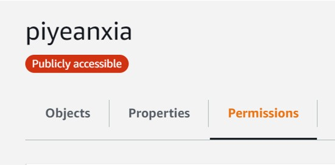
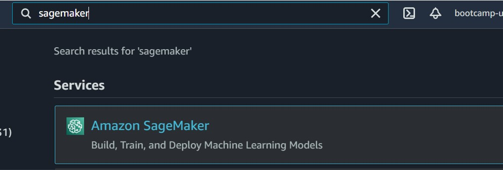
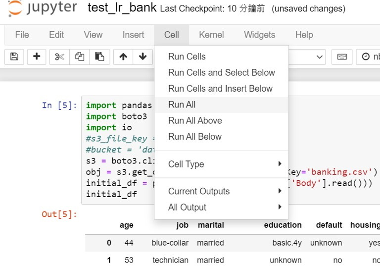

# Amazon SageMaker with Machine Learning

## Introduction


<p align="left">
Many companies hope to supplement data analysis or classification prediction through data mining & machine learning , but the external factors that affect business decisions are changing day by day and the new algorithms are published , so it's a difficult task to maintain and train the machine learning model. 


## Use case
This lab will put the data in **S3** and use the **Python SDK in SageMaker** to read the file , and use container to import data mining package(ex: **Scikit Learn , Pytorch ,Keras, Pandas**). I will use Scikit-learn in classification and forecast problem , and saved the best model to **.pkl(pickle)** file , it is convenient to use the Python SDK to do more applications in the future. 

It also can use SNS service to notice the data scientist the score of **AUC , F-Score , Precission** is lower than our baseline or not , discuss with users whether to add new variables or replace machine learning model.
<br>
**(This part will be finished in next topic)**

</p>


## Overview

SageMaker is fully managed service , it can help user to label data , data preprocessing , model training ,tuning model as the graph below :


* Prepare : If company want to do object recognization but they don't have enough people to define what category of data should be , SageMaker can help label things that have not yet been labled . However, in the publication of academic papers, experts or professional teams are still needed to help mark them, so that the experiments made are credible and will not be questioned by others as to whether they are fraudulent.
    * **Feature engineering :** how to define the attibute in data mining is a difficult task , different task will use different attibute . In NLP task , we often use TF-IDF , word embedding as independent variable , and in image detection often drop the noise.
    
    * **Data Preprocessing :** Not all data structures can be directly thrown into machine learning or deep learning, so the data will be pre-processed before entering the training. EX : it often do LabelEncoder or OneHotEncoder to present object data type , or the data value of attribute is too large, which will seriously effect other attributes (ex: the value of other fields is only between 0 and 100, but the value of a certain attribute larger than 10000000000000). The attribute will be scaled through MinMaxScaler. High dimension will lead to dimension course, so it can use LDA or select the K important attributes according to Information Gain.

* Build
    * classification Problem :
        * XGBoost : XGBoost is one of the most popular ML model on Kaggle. It not only has high accuracy and can be easily installed on java or python. SageMaker provides the XGBoost as container let user import. It also can use pip to download the package on Jupyter instance , this lab will import the package through the following code.<br>

            `from sagemaker.xgboost.estimator import XGBoost`<br>
            `from sagemaker.session import s3_input, Session`

        * Time series question :
            * Statical Method : Time series problems can use at forecasting stock or numerical forecasting SageMaker      provides Arima, Prophet and other methods that can be used.
                <br>
            * LSTM: We can import Lstm in Pytorch or Keras , and it often use at NLP task such as traslation(use Seq2Seq) or sentence classification , one the famous NLP model ELMO is Bi-Lstm architecture. 
    
    * image detection : 
        * The image recognition pretrained model in SageMaker has been able to recognize many objects. We only need to  through incremental learning to learn the object instead of training from scratch.

* Train & Tune :
    * Model Evaluation : use confusion matrix , classification_report from sklearn to evaluate the accuracy
    * Model Maintain : When the evaluation index is already lower than the baseline, the model should be changed
    * Gridsearch : use different learning rate , max(min) depth to find the best paramater
* Deploy &　Manage 
    * Visualize the results to senior management
    * Send the report to the customers who need it through the SNS service

## Prerequisites

* Please select "ml." instance
* You can use **pip ,git** easily in **Jupyter**

## Step by step


* STEP1 :
    * Create **S3 Bucket**
    * Click **S3** service in AWS console
        <p align="center">
        
        </p>
    * On the Block Public Access settings for bucket, "uncheck" Block all public access and any terms under it as below, and check
    "I acknowledge that the current settings might result in this bucket and the objects within becoming public" below.
        > Amazon S3 block public access prevents the application of any settings that allow public access to data within S3 buckets.
         In this  case, we will using public access to S3 bucket, so we uncheck the option.
         <p align="center">
        
        </p>
     
    * upload banking_.csv to S3
    > For the purposes of this lab, we obtained a sample dataset from the UCI Machine Learning Repository
        <p align="center">
        
        </p>
    * click permission and scroll down to edit policy
        <p align="center">
        
        </p>

    * copy the text to policy to change the Bucket policy that let the Python can **Get** or **push** the object.Make sure you have replaced **<YOUR_BUCKET_NAME>** with your own bucket name then click Save.

    ```
    {
    "Version": "2012-10-17",
    "Statement": [
        {
            "Sid": "PublicReadGetObject",
            "Effect": "Allow",
            "Principal": "*",
            "Action": [
                "s3:GetObject",
                "s3:PutObject"
            ],
            "Resource": "arn:aws:s3:::<yourBucketName>/*"
        }
    ]
    }
    ```
    
* STEP2 :
    * Click SageMaker on AWS Console
    <p align="center">
    
    </p>


* STEP3 :
    * On the left navigation pane, select **Notebook Instance**
        <p align="center">
        
        </p>
    * Create Notebook instance
        <p align="center">
        
        </p>
    * Click your own jupyter instance name and let every as deafault and click 
    **create notebook instance**
    
        <p align="center">
        
        </p>
    * It will take a few minutes to create the instance ,and check  the instance is created successfully.**sucessed**.
        <p align="center">
        
        </p>
    * Wait for the instance Status is **InService** and click **open Jypyter**
        <p align="center">
        
        </p>
    * We can see the Jupyter on your AWS service , and click **upload** to upload the **test_lr_bank.ipynb** to instance.
        <p align="center">
        
        </p>
    * open test_lr_bank.ipynb and change the bucket name
    <p align="center">
    
    </p>

    * click **cell** and **Run All**
        <p align="center">
        
        </p>
    >  The dataset split into two subsets(Train: 80%, Test: 20%), I use labelencoder to normalize the object attributes , and replace missing value with 0 . The goal of prediction classification is to predict whether the customer is (yes) or not (no) subscribing to a fixed deposit (variable y), and return the prediction result(**new.csv**) of the test data to the s3 Bucket
        <p align="center">
        
        </p>
    * check test data(**new.csv**) save to S3 sucessfully
        <p align="center">
        
        </p>
    
## **Another service on SageMaker**

* Why SageMaker Studio Notebooks? 
    * It can use AWS SSO as authentication, use the unique URL provided by AWS for the development team to log in and run the notebook without logging in to the AWS console.

    * Amazon SageMaker Studio notebooks pre-configure various package(Pytorch , Scikit-learn) for data science so that users can restart data science work, such as data pre-processing and modeling.
* Autopilot
    *  The task Autopilot can solve : 
        * Regression problem : linear regression 
        * Classifaction Problem(multi,binary) : such as XGBoost , Random Forest
        * Automatic problem type detection : Let SageMaker judge what kind of task it is. 
    * The algorithm Autopilot provide as shown below
        <p align="center">
        
        </p>
* Amazon SageMaker Debugger
    * Automatic detection, analysis, and alerts:<br>
    Amazon SageMaker Debugger can reduce troubleshooting during training from days to minutes by automatically detecting and alerting you to remediate common training errors such as gradient values becoming too large or too small.
    * Monitoring and profiling :<br> Amazon SageMaker Debugger automatically monitors utilization of system resources such as GPUs, CPUs, network, and memory, and profiles your training jobs to collect detailed ML framework metrics
    * Built-in analytics : <br>
    We can use gridsearch on different experient as a trial , and find the best paramater to machine learning model .
     <p align="center">
        
        </p>

    * Amazon SageMaker Model Monitor : <br>
    Accuracy will decrease by time , monitor and tune the model is an important task . Amazon SageMaker Model Monitor will check the accuracy is lower than baseline or not  Whether the data transmission is abnormal.
    * Use cloudwatch and SNS service to send the e-mail to supervison to alert the error immediately.


##


## Conclusion
Congratulations! You now have learned how to:


* How to create Jupyter instance on SageMaker
* How to use your own **.py** file on classifaction problems in AWS 
<br>

## Reference

* UCI Dataset<br>
https://archive.ics.uci.edu/ml/datasets/bank+marketing

* Amazon Document<br>
https://aws.amazon.com/tw/sagemaker/


* Python SageMaker SDK<BR>
https://sagemaker.readthedocs.io/en/stable/

* Amazon-sagemaker-examples<BR>
https://github.com/aws/amazon-sagemaker-examples

* Youtube Course <br>
https://youtu.be/uQc8Itd4UTs
